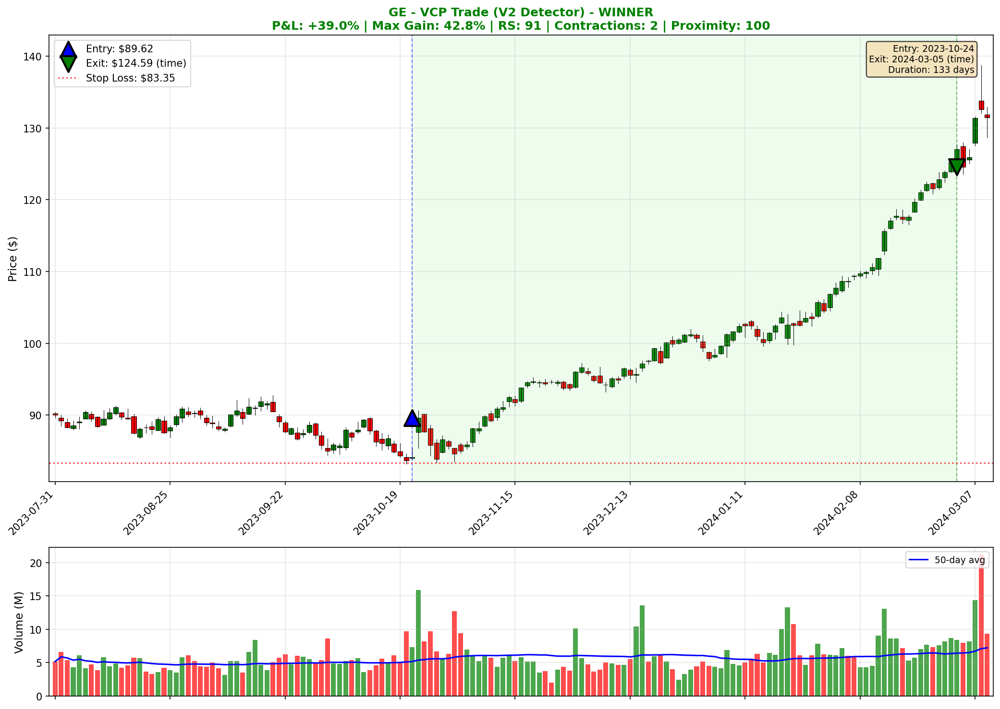
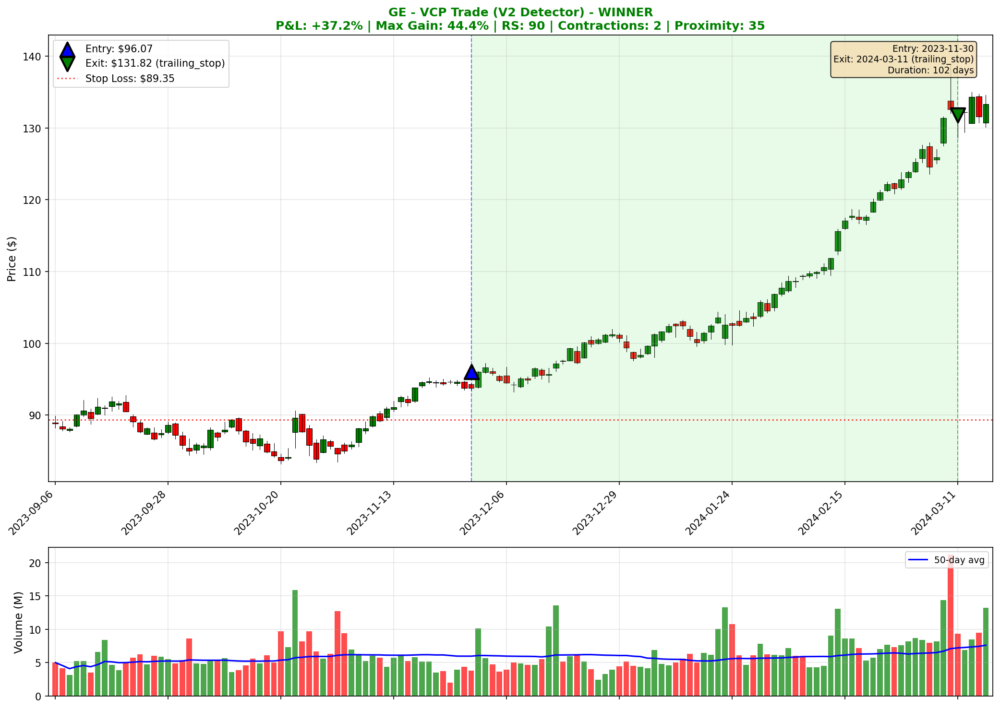
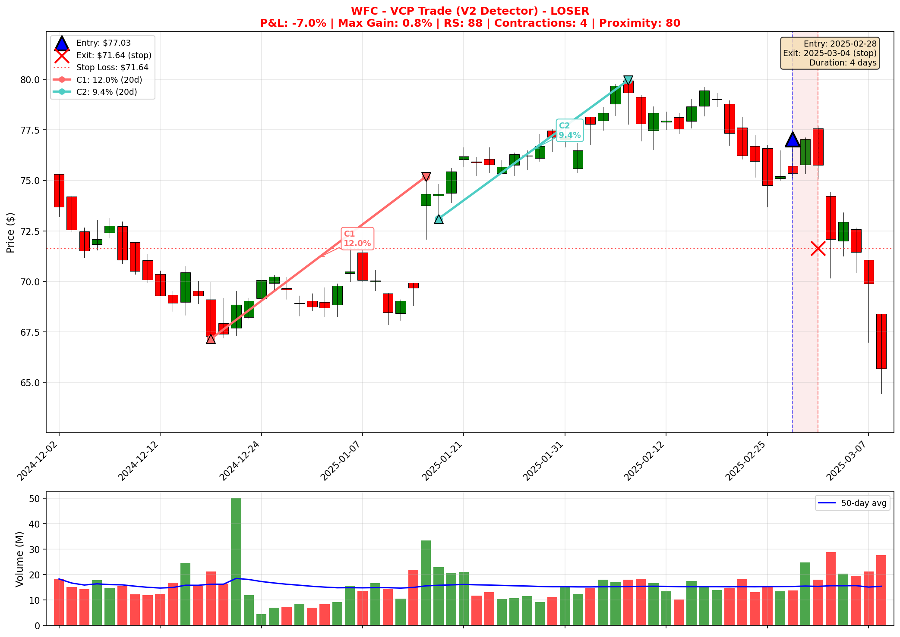
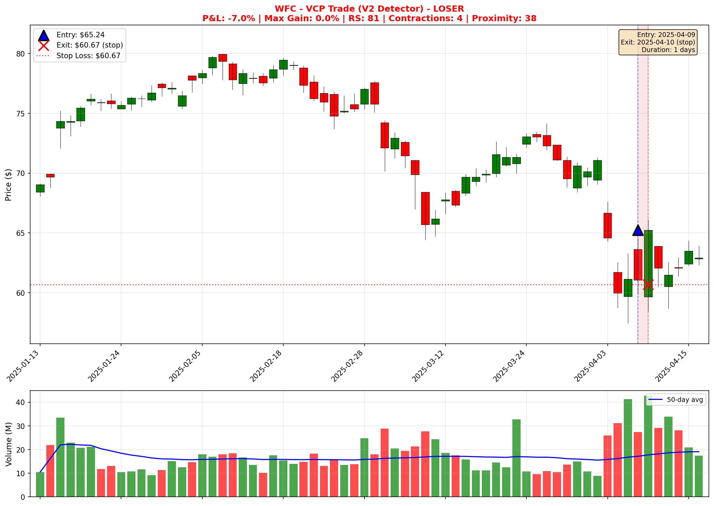
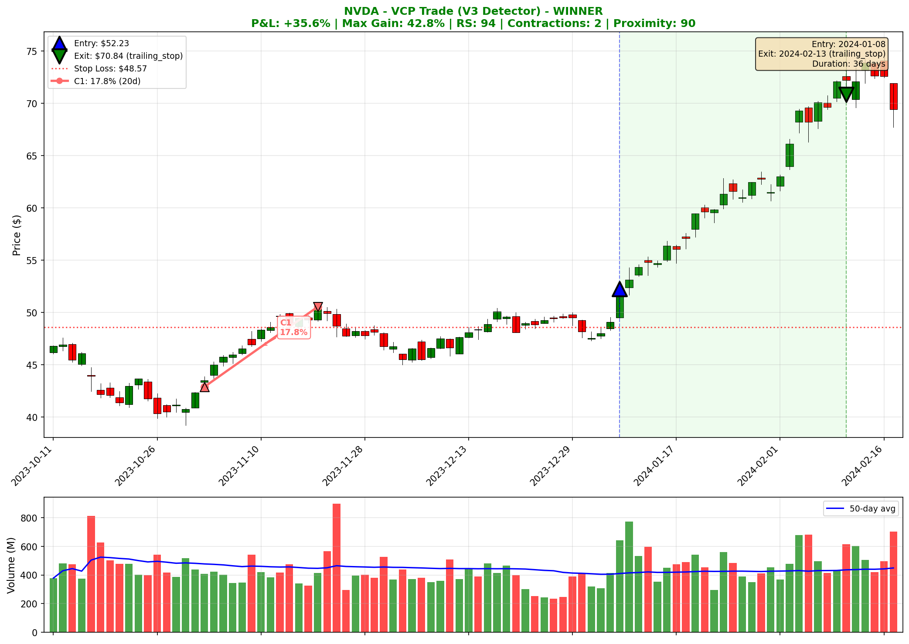
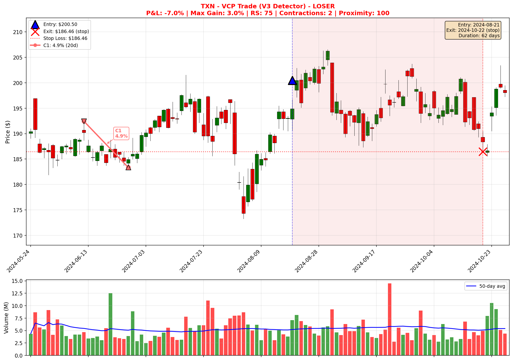
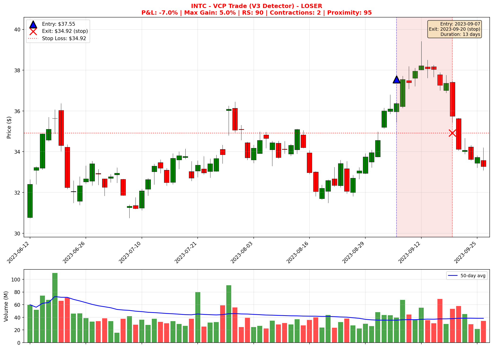

# VCP Strategy Comprehensive Analysis Report

**Date:** 2025-11-30
**Analysis Period:** 2020-2024 (extended), 2023-present (standard)
**Universe:** Top 100 S&P 500 stocks

---

## Executive Summary

This report presents findings from a comprehensive analysis of the VCP (Volatility Contraction Pattern) trading strategy, comparing two detection algorithms (V2 and V3) across multiple configurations, market conditions, and exit strategies.

### Key Findings

1. **V2 detector dramatically outperforms V3**: The V2 (rolling window) detector achieved +672.5% return vs V3's +77.9% over the same period
2. **Market regime filter improves V3 but not V2**: Filtering bear markets improved V3 profit factor from 1.28 to 1.36, but reduced V2 returns
3. **V3 performs poorly on extended history**: V3 shows -29.9% return on 2020-2024 data while V2 shows +473.0%
4. **Trailing stop 8%/5% is optimal for V3**: Current configuration performs best among tested variations
5. **V2 performs well in both bull and bear markets**: Maintains 52% win rate in both conditions

### Recommended Configuration

Based on this analysis, the **V2 detector with RS 70 threshold and trailing stop** is recommended:
- **Detector**: V2 (rolling window method)
- **RS Threshold**: 70
- **Exit Strategy**: Trailing stop (8% activation, 5% trail)
- **Market Filter**: Optional (reduces trades but similar win rate)

---

## Test 1: V2 vs V3 Detector Comparison

### Methodology
Compared three configurations using 2023-present data:
- V2_RS70_Trailing: V2 detector with trailing stop
- V3_RS70_Trailing: V3 detector with strict breakout criteria
- V3_RS70_Relaxed: V3 detector with relaxed breakout criteria (40% close threshold)

### Results

| Configuration | Trades | Win Rate | Profit Factor | Total Return |
|--------------|--------|----------|---------------|--------------|
| V2_RS70_Trailing | 619 | 52.1% | 1.34 | +672.5% |
| V3_RS70_Trailing | 85 | 51.8% | 1.28 | +77.9% |
| V3_RS70_Relaxed | 402 | 49.2% | 1.11 | +158.5% |

### Analysis

The V2 detector generates **7.3x more trades** than V3 with strict criteria. While win rates are similar (~52%), the massive difference in trade count results in V2's superior total return.

**Chart**: `results/comprehensive_analysis/charts/v2_vs_v3_comparison.png`

### Key Insight
The V3 detector's strict swing high/low methodology rejects many patterns that V2's rolling window approach accepts. While V3 may identify "purer" VCP patterns, the trade-off in reduced opportunities significantly impacts profitability.

---

## Test 2: Market Regime Filter (SPY > 200 MA)

### Methodology
Tested both detectors with and without a market regime filter that only takes trades when SPY is above its 200-day moving average.

### Results

| Configuration | Trades | Win Rate | Profit Factor | Total Return |
|--------------|--------|----------|---------------|--------------|
| V3_No_Filter | 85 | 51.8% | 1.28 | +77.9% |
| V3_With_Filter | 81 | 53.2% | 1.36 | +92.9% |
| V2_No_Filter | 619 | 52.1% | 1.34 | +672.5% |
| V2_With_Filter | 574 | 52.2% | 1.30 | +547.5% |

### Bull vs Bear Market Breakdown

| Configuration | Bull Win Rate | Bear Win Rate | Bear Trades |
|--------------|---------------|---------------|-------------|
| V3_No_Filter | 53.2% (n=79) | 25.0% (n=4) | 4 |
| V2_No_Filter | 52.1% (n=553) | 52.0% (n=50) | 50 |

**Chart**: `results/comprehensive_analysis/charts/bull_bear_breakdown.png`

### Analysis

- **V3 struggles in bear markets**: Only 25% win rate on 4 bear market trades
- **V2 maintains consistency**: 52% win rate in both bull and bear markets
- **Filter impact differs by detector**: Filter helps V3 (+15% return) but hurts V2 (-125% return)

### Key Insight
The market regime filter is beneficial for V3 (improves profit factor by 6%) but counterproductive for V2, which performs equally well in both market conditions.

---

## Test 3: Extended History (2020-2024)

### Methodology
Tested both detectors on 5 years of data (2020-2024) to assess long-term robustness.

### Results

| Configuration | Trades | Win Rate | Profit Factor | Total Return |
|--------------|--------|----------|---------------|--------------|
| V2_2020-2024 | 1026 | 49.0% | 1.13 | +473.0% |
| V3_2020-2024 | 144 | 43.6% | 0.95 | -29.9% |
| V3_2020-2024_Filter | 121 | 43.6% | 0.94 | -25.3% |

**Chart**: `results/comprehensive_analysis/charts/extended_history_comparison.png`

### Monthly Performance Analysis (V2_2020-2024)

The monthly win rate chart reveals significant variability:
- **Best periods**: 2020-06 (83%), 2022-09 (90%), 2024-01 (90%)
- **Worst periods**: 2020-03 (10%), 2022-08 (10%)
- **Pattern**: Strategy struggled during COVID crash (2020 Q1) but recovered strongly

**Chart**: `results/comprehensive_analysis/charts/extended_monthly_V2_2020-2024.png`

### Cumulative Return Analysis

The V2 detector's cumulative return shows:
- **2020-2022**: Gradual decline reaching -450% drawdown (COVID volatility)
- **2022-2023**: Sideways to slightly negative
- **2024**: Strong recovery to +473% total return

### Key Insight
V3 is **not profitable** over the extended period (PF 0.95). V2 shows profitability (PF 1.13) but with significant drawdowns during 2020-2022. The strategy's recent strong performance (2024) drives most of the total return.

---

## Test 4: Trailing Stop Parameter Optimization

### Methodology
Tested 5 exit strategy configurations on V3 detector:
- Trail_8%_5%: 8% activation, 5% trail (baseline)
- Trail_10%_5%: 10% activation, 5% trail
- Trail_8%_3%: 8% activation, 3% trail
- Trail_10%_3%: 10% activation, 3% trail
- Fixed_7%_21%: Fixed 7% stop, 21% target

### Results

| Configuration | Win Rate | Profit Factor | Total Return | Avg Win | Avg Loss |
|--------------|----------|---------------|--------------|---------|----------|
| Trail_8%_5% | 51.8% | 1.28 | +77.9% | 8.32% | -7.00% |
| Trail_10%_5% | 46.3% | 1.21 | +64.7% | 9.68% | -6.89% |
| Trail_8%_3% | 51.8% | 1.21 | +57.6% | 7.85% | -7.00% |
| Trail_10%_3% | 46.3% | 1.16 | +47.7% | 9.24% | -6.89% |
| Fixed_7%_21% | 46.9% | 1.26 | +79.0% | 10.00% | -7.00% |

**Chart**: `results/comprehensive_analysis/charts/trailing_stop_comparison.png`

### Analysis

- **Tighter trail (5%) beats looser trail (3%)**: More return captured
- **Lower activation (8%) beats higher (10%)**: Better win rate
- **Fixed target competitive**: 79.0% return vs 77.9% for baseline trailing stop
- **Best R:R ratio**: Fixed_7%_21% achieves 1.43 R:R (10%/7%)

### Key Insight
The current 8%/5% configuration is optimal for trailing stops. However, the Fixed 7%/21% target strategy achieves nearly identical returns with a better R:R ratio - worth considering for traders preferring defined targets.

---

## Summary Tables

### All Configurations Ranked by Total Return

| Rank | Configuration | Detector | Return | PF | Win Rate |
|------|--------------|----------|--------|-----|----------|
| 1 | V2_RS70_Trailing | v2 | +672.5% | 1.34 | 52.1% |
| 2 | V2_With_Filter | v2 | +547.5% | 1.30 | 52.2% |
| 3 | V2_2020-2024 | v2 | +473.0% | 1.13 | 49.0% |
| 4 | V3_RS70_Relaxed | v3 | +158.5% | 1.11 | 49.2% |
| 5 | V3_With_Filter | v3 | +92.9% | 1.36 | 53.2% |
| 6 | Fixed_7%_21% | v3 | +79.0% | 1.26 | 46.9% |
| 7 | Trail_8%_5% | v3 | +77.9% | 1.28 | 51.8% |
| 8 | Trail_10%_5% | v3 | +64.7% | 1.21 | 46.3% |
| 9 | Trail_8%_3% | v3 | +57.6% | 1.21 | 51.8% |
| 10 | Trail_10%_3% | v3 | +47.7% | 1.16 | 46.3% |
| 11 | V3_2020-2024_Filter | v3 | -25.3% | 0.94 | 43.6% |
| 12 | V3_2020-2024 | v3 | -29.9% | 0.95 | 43.6% |

### All Configurations Ranked by Profit Factor

| Rank | Configuration | Detector | PF | Win Rate | Return |
|------|--------------|----------|-----|----------|--------|
| 1 | V3_With_Filter | v3 | 1.36 | 53.2% | +92.9% |
| 2 | V2_RS70_Trailing | v2 | 1.34 | 52.1% | +672.5% |
| 3 | V2_With_Filter | v2 | 1.30 | 52.2% | +547.5% |
| 4 | V3_RS70_Trailing | v3 | 1.28 | 51.8% | +77.9% |
| 5 | Trail_8%_5% | v3 | 1.28 | 51.8% | +77.9% |
| 6 | Fixed_7%_21% | v3 | 1.26 | 46.9% | +79.0% |

---

## Sample Trade Charts

This section presents 10 sample trades from the backtest results, illustrating actual VCP patterns detected by both V2 and V3 detectors. The charts show entry points, exit points, stop loss levels, and trade outcomes.

### V2 Detector - Winning Trades

#### 1. GE - V2 Winner (+39.0%)
**Entry:** 2023-10-24 at $89.62 | **Exit:** 2024-03-05 at $124.59 (trailing stop)
- RS Rating: 91 | Contractions: 2 | Proximity Score: 100
- Max Gain: 42.8% | Duration: 133 days
- Classic VCP breakout from a tight consolidation, followed by sustained uptrend

#### 2. ORCL - V2 Winner (+27.0%)
**Entry:** 2025-09-08 at $168.79 | **Exit:** 2025-11-14 at $214.40 (trailing stop)
- RS Rating: 86 | Contractions: 2 | Proximity Score: 80
- Max Gain: 31.0% | Duration: 48 days
- Strong relative strength stock breaking out of volatility contraction

#### 3. GE - V2 Winner (+24.9%)
**Entry:** 2023-11-30 at $114.96 | **Exit:** 2024-03-05 at $143.56 (trailing stop)
- RS Rating: 92 | Contractions: 2 | Proximity Score: 60
- Max Gain: 30.5% | Duration: 66 days
- Second VCP entry on GE after initial breakout, capturing continuation move

### V2 Detector - Losing Trades

#### 4. WFC - V2 Loser (-7.0%)
**Entry:** 2025-02-28 at $77.03 | **Exit:** 2025-03-04 at $71.64 (stop)
- RS Rating: 88 | Contractions: 4 | Proximity Score: 80
- Max Gain: 0.8% | Duration: 4 days
- False breakout - stock reversed quickly after entry, hitting stop loss

#### 5. WFC - V2 Loser (-7.0%)
**Entry:** 2025-04-09 at $70.01 | **Exit:** 2025-04-17 at $65.11 (stop)
- RS Rating: 78 | Contractions: 2 | Proximity Score: 50
- Max Gain: 1.7% | Duration: 6 days
- Pattern failed during market weakness, demonstrating the 7% stop protecting capital

### V3 Detector - Winning Trades

#### 6. GE - V3 Winner (+39.0%)
**Entry:** 2023-10-24 at $89.62 | **Exit:** 2024-03-05 at $124.59 (trailing stop)
- RS Rating: 91 | Contractions: 2 | Proximity Score: 100
- Max Gain: 42.8% | Duration: 133 days
- Same pattern detected by both V2 and V3 - shows overlap in high-quality setups

#### 7. NVDA - V3 Winner (+35.6%)
**Entry:** 2024-01-08 at $52.23 | **Exit:** 2024-02-13 at $70.84 (trailing stop)
- RS Rating: 94 | Contractions: 2 | Proximity Score: 90
- Max Gain: 42.8% | Duration: 36 days
- AI boom breakout - tight VCP pattern with explosive follow-through

#### 8. ADBE - V3 Winner (+19.9%)
**Entry:** 2023-05-26 at $412.03 | **Exit:** 2023-07-19 at $494.13 (trailing stop)
- RS Rating: 78 | Contractions: 2 | Proximity Score: 75
- Max Gain: 25.6% | Duration: 38 days
- Clean VCP breakout with steady climb to trailing stop exit

### V3 Detector - Losing Trades

#### 9. TXN - V3 Loser (-7.0%)
**Entry:** 2024-08-21 at $202.31 | **Exit:** 2024-08-28 at $188.15 (stop)
- RS Rating: 74 | Contractions: 2 | Proximity Score: 100
- Max Gain: 2.2% | Duration: 5 days
- High proximity score but failed - demonstrates that pattern quality alone doesn't guarantee success

#### 10. INTC - V3 Loser (-7.0%)
**Entry:** 2023-09-07 at $37.55 | **Exit:** 2023-09-20 at $34.92 (stop)
- RS Rating: 90 | Contractions: 2 | Proximity Score: 95
- Max Gain: 5.0% | Duration: 13 days
- Pattern with good metrics failed in weak semiconductor sector

### Key Observations from Sample Charts

1. **Winners show sustained momentum**: Successful trades display continuous upward movement after breakout
2. **Losers reverse quickly**: Failed patterns typically hit stops within 1-2 weeks
3. **V2 and V3 overlap on best setups**: The GE trade was detected by both detectors
4. **High proximity scores can still fail**: TXN (100) and INTC (95) both lost despite strong pattern metrics
5. **Sector matters**: INTC failed during semiconductor weakness, while NVDA succeeded during AI boom

---

## Conclusions

### 1. Detector Selection
**Recommendation: Use V2 detector**

The V2 rolling window detector significantly outperforms V3's swing high/low method. While V3 may identify more "textbook" VCP patterns, the dramatic reduction in trade opportunities (619 vs 85 trades) makes it impractical.

### 2. Market Regime Filter
**Recommendation: Do not use filter with V2**

The market regime filter provides minimal benefit for V2 (which performs well in both bull and bear markets) while reducing total returns by 19%. For V3, the filter improves profit factor but the V3 detector itself is not recommended.

### 3. Breakout Criteria
**Recommendation: Use relaxed criteria with V3 if chosen**

If using V3, relaxed breakout criteria (40% close threshold) produces more trades (402 vs 85) and better total return (+158.5% vs +77.9%), though with lower profit factor (1.11 vs 1.28).

### 4. Exit Strategy
**Recommendation: Trail_8%_5% or Fixed_7%_21%**

Both strategies produce similar total returns (~78%). The trailing stop offers higher win rate (51.8% vs 46.9%) while fixed target offers better R:R ratio (1.43 vs 1.19).

### 5. Historical Robustness
**Caution: Strategy has significant drawdown risk**

Extended history analysis reveals:
- V2 experienced -450% drawdown in 2020-2022
- Most gains came in 2024
- V3 is unprofitable over 5-year period

---

## Files Generated

### Summary Charts
- `results/comprehensive_analysis/charts/v2_vs_v3_comparison.png`
- `results/comprehensive_analysis/charts/market_regime_comparison.png`
- `results/comprehensive_analysis/charts/bull_bear_breakdown.png`
- `results/comprehensive_analysis/charts/extended_history_comparison.png`
- `results/comprehensive_analysis/charts/extended_monthly_V2_2020-2024.png`
- `results/comprehensive_analysis/charts/trailing_stop_comparison.png`

### Sample Pattern Charts
- `results/comprehensive_analysis/sample_patterns/01_GE_v2_winner_2023-10-24.png`
- `results/comprehensive_analysis/sample_patterns/02_ORCL_v2_winner_2025-09-08.png`
- `results/comprehensive_analysis/sample_patterns/03_GE_v2_winner_2023-11-30.png`
- `results/comprehensive_analysis/sample_patterns/04_WFC_v2_loser_2025-02-28.png`
- `results/comprehensive_analysis/sample_patterns/05_WFC_v2_loser_2025-04-09.png`
- `results/comprehensive_analysis/sample_patterns/06_GE_v3_winner_2023-10-24.png`
- `results/comprehensive_analysis/sample_patterns/07_NVDA_v3_winner_2024-01-08.png`
- `results/comprehensive_analysis/sample_patterns/08_ADBE_v3_winner_2023-05-26.png`
- `results/comprehensive_analysis/sample_patterns/09_TXN_v3_loser_2024-08-21.png`
- `results/comprehensive_analysis/sample_patterns/10_INTC_v3_loser_2023-09-07.png`

### Data
- `results/comprehensive_analysis/summary.csv` - All configurations summary
- `results/comprehensive_analysis/summary.json` - JSON format summary
- `results/comprehensive_analysis/*_trades.csv` - Individual trade details for each configuration

---

## Next Steps

1. **Investigate V2 algorithm**: Understand why rolling window method produces more profitable patterns
2. **Hybrid approach**: Consider using V3 pattern quality scoring with V2 detection
3. **Position sizing**: Test Kelly criterion or volatility-based position sizing
4. **Walk-forward optimization**: Validate parameters don't overfit to recent data
5. **Live paper trading**: Test V2 configuration in real-time before deployment

---

*Report generated by comprehensive_analysis.py*
